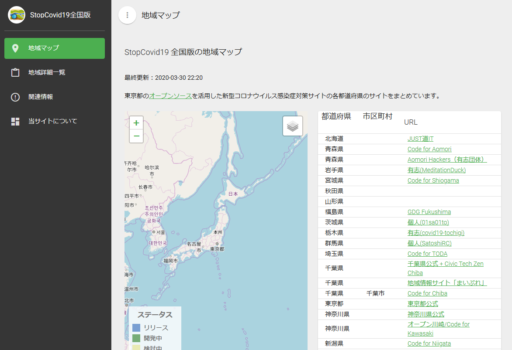

東京都の新型コロナウイルス感染症対策サイトの地域派生情報
-------

「東京都 新型コロナウイルス感染症対策サイト」の地域派生サイト及び関連情報サイトです

## 東京都 新型コロナウイルス感染症対策サイト
* [東京都 新型コロナウイルス感染症対策サイト / Tokyo COVID-19 Task Force website](https://stopcovid19.metro.tokyo.lg.jp/)
  * [GitHub](https://github.com/tokyo-metropolitan-gov/covid19)
* [行動規範](https://github.com/tokyo-metropolitan-gov/covid19/wiki/Principle)
* [貢献の仕方](https://github.com/tokyo-metropolitan-gov/covid19/blob/development/.github/CONTRIBUTING.md)

## 使用ツール

* Vue.js
* Vuetify
* Vuex
* Vue-cli
* Mapbox - <https://www.mapbox.com/>
* [templete - vuetify-material-dashboard](https://www.creative-tim.com/product/vuetify-material-dashboard?ref=vuetifyjs.com)

## Access token
You'll need a Mapbox access token. 

see alos: https://docs.mapbox.com/help/glossary/access-token

## Getting Started
- Install Nodejs from [Nodejs Official Page](https://nodejs.org/en/)
- Open your terminal
- Navigate to the project
- Run `npm install` or `yarn install` if you use [Yarn](https://yarnpkg.com/en/)
- Run `npm run dev` or `yarn serve` to start a local development server
- A new tab will be opened in your browser

You can also run additional npm tasks such as
- `npm run build` to build your app for production
- `npm run lint` to run linting.

## Documentation
The documentation for the **Vuetify Material Dashboard** is hosted on vuetify [website](https://vuetifyjs.com/en/components/api-explorer).

## Licensing
* Creative Tim [license](https://www.creative-tim.com/license)
